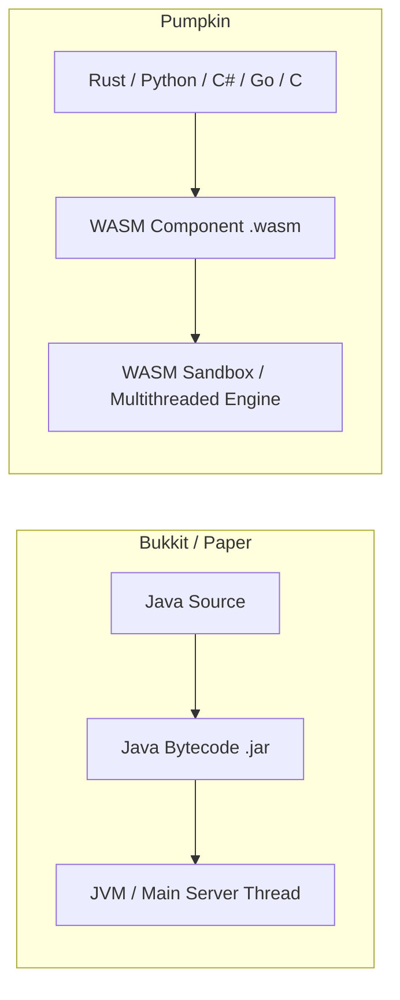

# Migrating Overview & Architecture

Moving from **Bukkit / Spigot / Paper** plugin development to Pumpkin involves shifting from a Java-centric object-oriented model to a compiled, multi-language **WebAssembly (WASM)** component model.

---

## High-Level Architectural Differences

| Concept | Bukkit / Spigot / Paper | Pumpkin |
| :--- | :--- | :--- |
| **Language Support** | Java / Kotlin / Scala (JVM) | Rust, Python, Kotlin, C#, Go, C |
| **Binary Output** | `.jar` Java Archive | `.wasm` WebAssembly Component |
| **Plugin Descriptor** | `plugin.yml` file | Programmatic `PluginMetadata` struct |
| **Lifecycle Hooks** | `onEnable()` / `onDisable()` | `on_load(context)` / `on_unload(context)` |
| **Security & Isolation** | Unrestricted JVM Reflection | Sandboxed WASM capability model |
| **Concurrency** | Single-threaded tick loop (`BukkitScheduler`) | Multithreaded native execution with Async runtime |

---

## Detailed Migration Topics

Explore dedicated guides on migrating each major plugin subsystem:

- [Migrating Commands](./commands) — Transitioning from `getCommand().setExecutor()` and `plugin.yml` to Brigadier command trees.
- [Migrating Events](./events) — Replacing `@EventHandler` and `Listener` interfaces with Pumpkin's blocking vs. non-blocking event system.
- [Migrating Inventories & GUIs](./inventories) — Moving from `Bukkit.createInventory()` to Pumpkin container and window handlers.
- [Migrating Configuration & Data](./configuration) — Replaces `getConfig()` / `config.yml` with native TOML, JSON, or custom storage.
